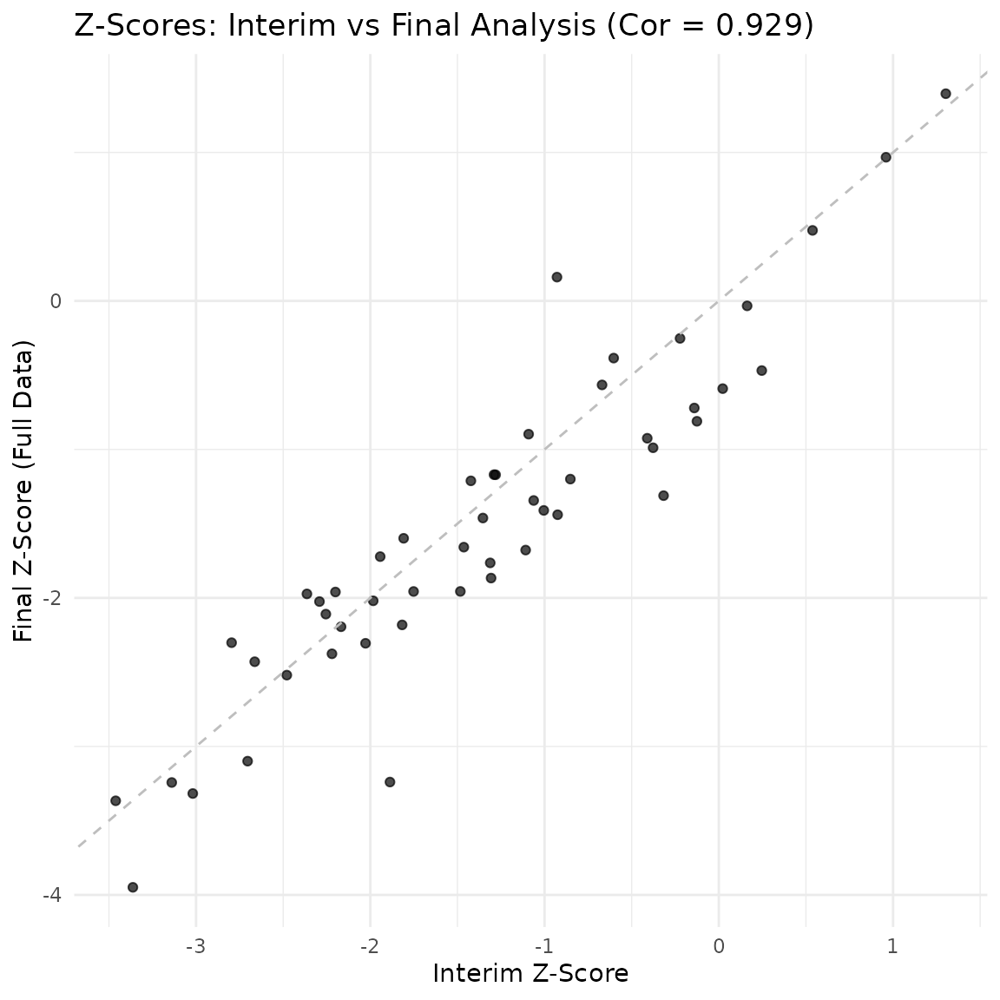

# Group sequential simulation with completers analysis

``` r
library(gsDesignNB)
library(gsDesign)
library(data.table)
library(ggplot2)
library(gt)
```

This vignette demonstrates how to simulate a group sequential design
where an interim analysis is conducted based on a specific number of
“completers” (subjects who have finished their follow-up).

## Simulation setup

We define a trial with the following parameters:

- **Sample size:** 200 patients.
- **Enrollment:** Recruited over 12 months.
- **Follow-up:** 2 years maximum follow-up per patient.
- **Interim analysis:** Conducted when 40% of patients (80 subjects)
  have completed their 2-year follow-up. The interim analysis includes
  all data available at that time (completers and partial follow-up).
- **Final analysis:** Conducted when all patients have completed
  follow-up (or dropped out). Includes all available data.

``` r
# Parameters
n_total <- 200
enroll_duration <- 12 # months
max_followup <- 12 # months (using months as time unit for clarity)

# Convert to years if rates are annual, but let's stick to consistent units.
# Let's say rates are per YEAR, so we convert time to years.
# Time unit: Year
n_total <- 200
enroll_duration <- 1 # 1 year
max_followup <- 1 # 1 year

enroll_rate <- data.frame(
  rate = n_total / enroll_duration,
  duration = enroll_duration
)

fail_rate <- data.frame(
  treatment = c("Control", "Experimental"),
  rate = c(0.5, 0.35), # Events per year
  dispersion = c(0.5, 0.5) # Negative binomial dispersion
)

dropout_rate <- data.frame(
  treatment = c("Control", "Experimental"),
  rate = c(0.05, 0.05),
  duration = c(100, 100)
)
```

## Simulation loop

We will simulate 50 trials. For each trial, we perform the interim and
final analyses.

``` r
set.seed(2024)
n_sims <- 50
results <- data.frame(
  sim_id = integer(n_sims),
  interim_date = numeric(n_sims),
  interim_z = numeric(n_sims),
  interim_n = integer(n_sims),
  interim_info = numeric(n_sims),
  final_date = numeric(n_sims),
  final_z = numeric(n_sims),
  final_n = integer(n_sims),
  final_info = numeric(n_sims),
  info_frac = numeric(n_sims)
)

# Target completers for interim (40%)
target_completers <- 0.4 * n_total

for (i in 1:n_sims) {
  # 1. Simulate Trial Data
  sim_data <- nb_sim(
    enroll_rate = enroll_rate,
    fail_rate = fail_rate,
    dropout_rate = dropout_rate,
    max_followup = max_followup,
    n = n_total
  )

  # 2. Interim Analysis
  # Find date when target_completers is reached
  interim_date <- cut_date_for_completers(sim_data, target_completers)

  # Cut data for completers at this date
  data_interim <- cut_completers(sim_data, interim_date)

  # Analyze (Mütze Test)
  res_interim <- mutze_test(data_interim)
  # Extract Z-statistic
  z_interim <- res_interim$z
  # Extract Information
  info_interim <- 1 / res_interim$se^2

  # 3. Final Analysis (All Data)
  # Date is when last patient completes (or max follow-up reached)
  # For final analysis, we use all data collected up to the end of the study.
  # The end of the study is when the last patient reaches max_followup.
  date_final <- max(sim_data$calendar_time)

  # Cut data at final date (includes partial follow-up for dropouts, full for completers)
  data_final <- cut_data_by_date(sim_data, date_final)

  res_final <- mutze_test(data_final)
  z_final <- res_final$z
  # Extract Information
  info_final <- 1 / res_final$se^2

  # Store results
  results$sim_id[i] <- i
  results$interim_date[i] <- interim_date
  results$interim_z[i] <- z_interim
  results$interim_n[i] <- nrow(data_interim)
  results$interim_info[i] <- info_interim
  results$final_date[i] <- date_final
  results$final_z[i] <- z_final
  results$final_n[i] <- nrow(data_final)
  results$final_info[i] <- info_final
  results$info_frac[i] <- info_interim / info_final
}

# Compute asymptotic information
# Interim
info_asymp_interim <- compute_info_at_time(
  analysis_time = mean(results$interim_date),
  accrual_rate = n_total / enroll_duration,
  accrual_duration = enroll_duration,
  lambda1 = fail_rate$rate[1],
  lambda2 = fail_rate$rate[2],
  dispersion = fail_rate$dispersion[1],
  ratio = 1,
  dropout_rate = dropout_rate$rate[1] # Assuming equal dropout
)

# Final
info_asymp_final <- compute_info_at_time(
  analysis_time = mean(results$final_date),
  accrual_rate = n_total / enroll_duration,
  accrual_duration = enroll_duration,
  lambda1 = fail_rate$rate[1],
  lambda2 = fail_rate$rate[2],
  dispersion = fail_rate$dispersion[1],
  ratio = 1,
  dropout_rate = dropout_rate$rate[1]
)

message("Asymptotic Information (Interim): ", round(info_asymp_interim, 2))
#> Asymptotic Information (Interim): 15.54
message("Mean Simulated Information (Interim): ", round(mean(results$interim_info), 2))
#> Mean Simulated Information (Interim): 14.51
message("Asymptotic Information (Final): ", round(info_asymp_final, 2))
#> Asymptotic Information (Final): 22.81
message("Mean Simulated Information (Final): ", round(mean(results$final_info), 2))
#> Mean Simulated Information (Final): 17.34
```

## Results summary

We summarize the distribution of the test statistics (Z-scores) at the
interim and final analyses.

``` r
summary(results[, c("interim_date", "interim_z", "interim_info", "final_date", "final_z", "final_info", "info_frac")])
#>   interim_date     interim_z       interim_info     final_date   
#>  Min.   :1.310   Min.   :-3.461   Min.   : 9.16   Min.   :1.877  
#>  1st Qu.:1.387   1st Qu.:-2.192   1st Qu.:13.11   1st Qu.:1.950  
#>  Median :1.406   Median :-1.333   Median :14.07   Median :1.983  
#>  Mean   :1.416   Mean   :-1.357   Mean   :14.51   Mean   :1.992  
#>  3rd Qu.:1.445   3rd Qu.:-0.620   3rd Qu.:15.65   3rd Qu.:2.029  
#>  Max.   :1.544   Max.   : 1.303   Max.   :21.49   Max.   :2.173  
#>     final_z         final_info      info_frac     
#>  Min.   :-3.949   Min.   :10.71   Min.   :0.7194  
#>  1st Qu.:-2.163   1st Qu.:15.92   1st Qu.:0.7933  
#>  Median :-1.628   Median :17.03   Median :0.8296  
#>  Mean   :-1.523   Mean   :17.34   Mean   :0.8373  
#>  3rd Qu.:-0.904   3rd Qu.:19.06   3rd Qu.:0.8809  
#>  Max.   : 1.396   Max.   :24.68   Max.   :0.9460
```

### Visualization

Comparison of Z-scores at Interim vs Final Analysis.

``` r
# Correlation between interim and final Z-scores
cor_z <- cor(results$interim_z, results$final_z)
message("Correlation between interim and final Z-scores: ", round(cor_z, 3))
#> Correlation between interim and final Z-scores: 0.929

ggplot(results, aes(x = interim_z, y = final_z)) +
  geom_point(alpha = 0.7) +
  geom_abline(intercept = 0, slope = 1, linetype = "dashed", color = "gray") +
  labs(
    title = paste0("Z-Scores: Interim vs Final Analysis (Cor = ", round(cor_z, 3), ")"),
    x = "Interim Z-Score",
    y = "Final Z-Score (Full Data)"
  ) +
  theme_minimal()
```



The plot shows the correlation between the interim statistic (based on
40% completers) and the final statistic.

### Group sequential design evaluation

We can evaluate the operating characteristics of this design using the
simulated Z-scores and information fractions. We assume an
O’Brien-Fleming spending function for the upper bound.

``` r
# Define design parameters
alpha <- 0.025
k <- 2
sfu <- sfLDOF # Lan-DeMets O'Brien-Fleming approximation

# Calculate bounds for each simulation based on observed information fraction
# Note: In practice, bounds are often fixed or recalculated. Here we check rejection rates.
# We'll use the mean information fraction to set a single boundary for simplicity in this summary,
# or we could check each trial individually. Let's check individually.

reject <- logical(n_sims)
for (i in 1:n_sims) {
  # Compute boundary for interim
  # We need to spend alpha based on info_frac[i]
  # Using gsDesign to get the boundary
  # We want to spend alpha(t) = alpha * sf(t)
  # But standard group sequential design defines boundaries.

  # Let's use a simple error spending approach:
  # Spend alpha_1 at interim based on info_frac[i]
  # Spend remaining alpha at final (total alpha = 0.025)

  # Interim spending
  spend_interim <- sfu(alpha, t = results$info_frac[i])$spend
  # Interim bound (Z-scale)
  # P(Z > b1) = spend_interim
  b1 <- qnorm(1 - spend_interim)

  # Check interim rejection
  if (results$interim_z[i] > b1) {
    reject[i] <- TRUE
  } else {
    # Final analysis
    # We need to find b2 such that P(Z1 < b1, Z2 > b2) = alpha - spend_interim
    # This requires integration over the joint distribution.
    # For simplicity in this vignette, we can use the asymptotic correlation
    # Cor(Z1, Z2) = sqrt(info_frac)

    # Using gsDesign to compute the exact boundary given the fraction
    # We create a design with this fraction
    gs_des <- gsDesign(k = 2, test.type = 1, alpha = alpha, sfu = sfu, timing = results$info_frac[i])
    b2 <- gs_des$upper$bound[2]

    if (results$final_z[i] > b2) {
      reject[i] <- TRUE
    }
  }
}

message("Power (Empirical Rejection Rate): ", mean(reject))
#> Power (Empirical Rejection Rate): 0
```
